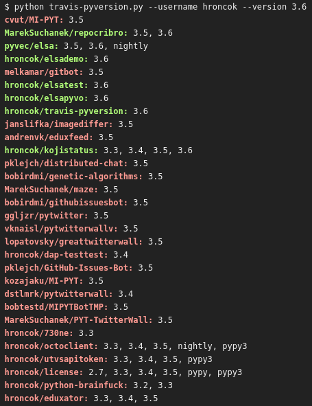

travis-pyversion
================

A small script that helps you check if your Python version on Travis CI is
recent enough.
It goes trough your public GitHub repos and checks `.travis.yml`.

Installation
------------

Only works with Python 3.6 or later. It's recommended to use virtual
environment for dependencies:

    $ python3.6 -m venv __env__
    $ . __env__/bin/activate
    (__env__) $ pip install -r requirements.txt

Usage
-----

    (__env__) $ python travis-pyversion.py --help
    Usage: travis-pyversion.py [OPTIONS]
    
    Options:
      --username TEXT                 Your GitHub username/organization.
      --version TEXT                  Python version to check.
      --token TEXT                    GitHub token (optional, will fetch
                                      anonymously if not provided, may hit rate
                                      limit).
      --repo-type [all|owner|member]  Repo types to check, default: all.
      --forks / --no-forks            Whether to check forks (default is not to).
      --help                          Show this message and exit.

You need to provide your GitHub username and the Python version you want to
check. If you don't use the command line options, the script will prompt you
with reasonable defaults. You can provide a
[GitHub token](https://github.com/settings/tokens) (no scope needed)
if you ever hit the API rate limit.

The output
----------

The script will output a list of your repos with Pythonic `.travis.yml` and the
Python versions in there. Please note that repos containing the specified
version of Python will be green and printed to the standard output, whereas
repos without it will be red and printed to the standard error. 

License
-------

This is a free software licensed under the terms of the so-called MIT license.
See [LICENSE](LICENSE) for full text.
